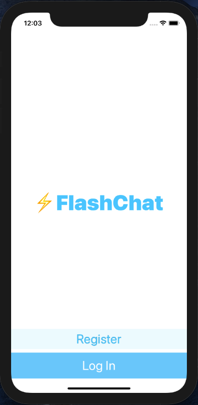
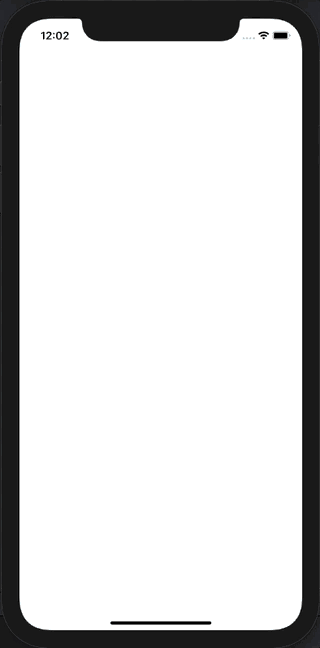
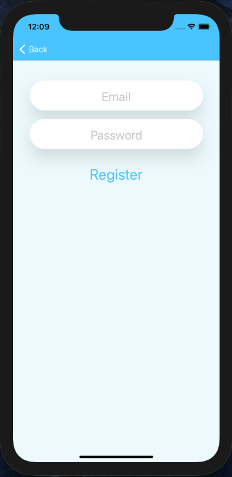
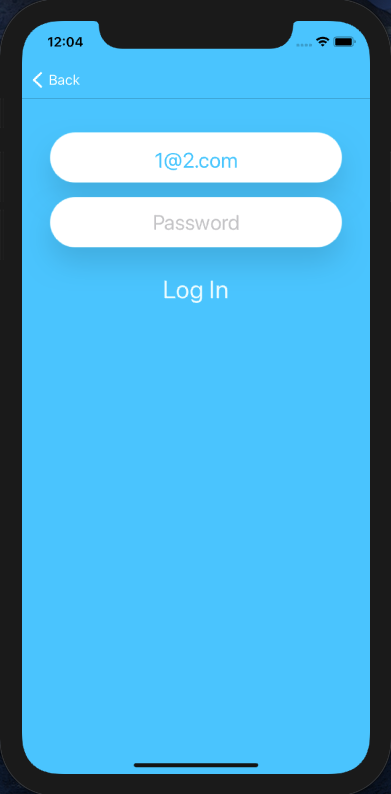
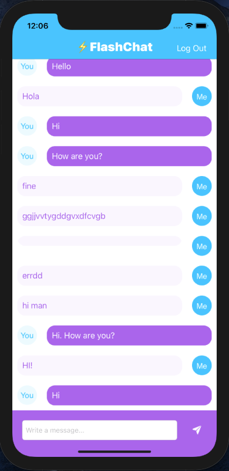
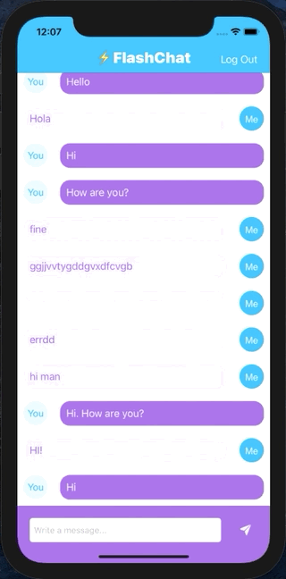

# Messenger
___
## Оглавление
- **[Описание](#Description)**
- **[Презентация](#Presentation)**

## Описание
Мессенджер. Учебный проект.

- Проект написан на **UIKit**
- Использована стандартная архитектура **MVC** 
- Верстка интерфейса **Storyboard + XIB**
- Основа **Firebase**
- Авторизация **Firebase/Auth**
- Дополнительно под-украшалка **CLTypingLabel**
- Дополнительная библиотека **IQKeyboardManagerSwift** через **Swift Package Dependencies**

___

## Презентация
### Стартовый экран

### Экран регистрации

### Экран входа

### Основной экран

___

